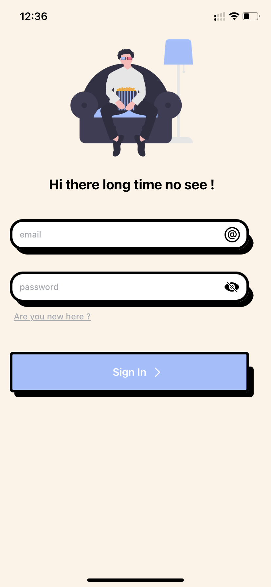
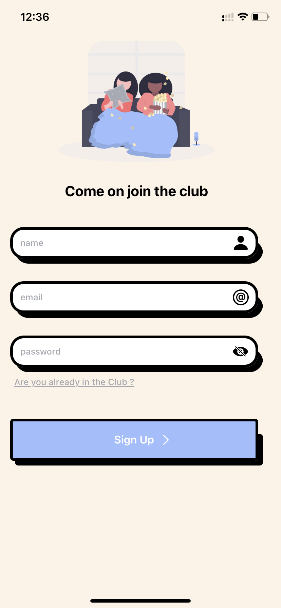
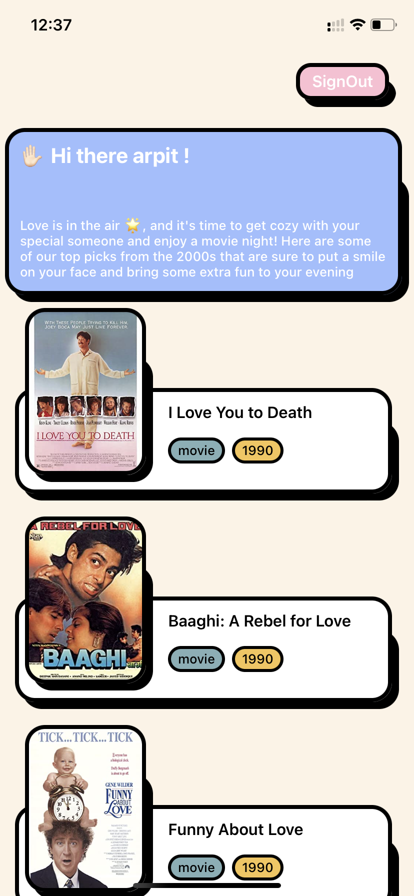

#  Movie Time

## Description

The application showcases romantic movies released after the year 2000 using the OMDB API. It is based on the Model-View-Controller (MVC) architecture, with the user interface components implemented using UIKit without the use of storyboards.

Asynchronous tasks and event listening are performed using the Combine framework. For dependency management, the dependency inversion principle has been followed and a container pattern is used in the application. The most of business logic has been is coverd throught unit tests.

## Screenshots

 
 
   

## Packages Used

- Nuke (For Poster Image Caching )
- Combine
- UIKit
- XCTest
